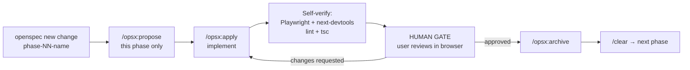

@AGENTS.md

# In Utero Inc. Website — Project Conventions

## Project Overview

This is a **bilingual (English + Traditional Chinese)** static marketing website for
**In Utero Inc.** Built with **Next.js 16 App Router + React 19 + Tailwind CSS v4**, deployed
on **Vercel**. No backend, no database. Long-form content (portfolio projects, news articles)
lives as MDX files in the repo; everything else is colocated in components.

## Read These First

Do not re-derive what has already been established. Before any implementation work:

| Document | What it gives you |
| :--- | :--- |
| `openspec/reference/routes.md` | Canonical route table, locale strategy, resolved naming drift |
| `openspec/reference/design-inventory.md` | Figma canvas map, every page/component node ID, do-not-implement list |
| `openspec/reference/design-tokens.md` | All 124 design tokens, all modes. **Source of truth for `@theme`.** |
| `openspec/reference/content-matrix.md` | Every string on the site, both locales. **Source of truth for copy — outranks the Figma text layers.** Also lists what the client still owes. |
| `openspec/reference/roadmap.md` | The live phase plan — what is done, what this phase is, and work earlier phases deferred to yours |
| `openspec/DECISIONS.md` | Decisions the design does not make for us — read before inventing one |
| `app/_components/INVENTORY.md` | What components already exist. **Read before building any component.** |

## Design Source of Truth

Figma file **`zSq5F5v3UrVAdIjuSipe3H`** — https://www.figma.com/design/zSq5F5v3UrVAdIjuSipe3H/

This is a copy living in the "Test Team" workspace, where the account holds a Pro + Full seat
(200 Figma MCP calls/day). The original `7uC2EQp61AsMp8ebZQcI7w` sits on another team where the
account only has a View seat (6 calls/month) — **do not use it**. All node IDs are identical
between the two files, so node references remain valid.

| Canvas | Node ID | Use |
| :--- | :--- | :--- |
| Desktop | `12405:6628` | `DESKTOP` (EN) + `DESKTOP 中文` (TC) + `COMP` |
| Mobile | `6383:168` | `MOBILE` (EN) + `MOBILE 中文` (TC) + `COMP` |
| Sitemap | `5999:10562` | Information architecture only — no visual design |

**Do not implement these nodes.** They will show up in a broad metadata sweep and are not
the current design:

- `12646:20652` — desktop `archived` section (superseded Hero, Intro, ServicesAccordion)
- `10268:1854` — mobile `ref` section (moodboard scraps)
- `10270:2212` — mobile `photo` section (loose photography)

## Critical: Figma Design Workflow

Before implementing any section or page:

1. **Always fetch live design context** — use `/figma-design-to-code` skill first (mandatory
   prerequisite), then call Figma MCP tools (`get_design_context`, `get_screenshot`,
   `get_metadata`) for the relevant node(s). Never assume or hardcode values from memory.
   Look up node IDs in `openspec/reference/design-inventory.md`.
2. **Fetch all four frames for a section** — desktop EN, desktop TC, mobile EN, mobile TC.
   TC is not EN with swapped strings; layouts genuinely differ where text length forced it
   (Featured Artists mobile is 5115px EN vs 3416px TC).
3. **Visual verification is non-negotiable** — after each code change:
   - Use `next-devtools-mcp` to check for framework errors/warnings in the running app.
   - Use `playwright-cli` to screenshot the implemented section in a real browser, at
     **393px and 1440px**, in **both locales**.
   - Compare side-by-side against the Figma screenshot.
   - Do this per-section before marking done, not once at the end.
4. **Figma MCP quota is 200 calls/day, 15/min** on the current seat. Ample, but if you ever
   hit it mid-phase, **stop and report** — never proceed from memory or a stale cache and
   present the result as matching the design.

### Fidelity Tiers

"Pixel-perfect" is not a blanket instruction. Match the effort to the tier:

| Tier | Applies to | Bar |
| :--- | :--- | :--- |
| **Exact** | NAV, Home hero, UniversalCTA, Footer, all typography tokens | Spacing, size, and color match. Iterate until they do. |
| **Close** | All other page sections | Visually indistinguishable at 100% zoom. Stop at ≤4px drift. |
| **Derived** | Tablet (768–1439px), hover/focus/motion states | No Figma reference exists. See "Responsive" below — ask, do not silently invent. |

## Internationalization

The site ships in English and Traditional Chinese. Both locales exist in full in Figma.

| Aspect | Rule |
| :--- | :--- |
| Locales | `en` (default), `zh` |
| URLs | Explicit prefix on both — `/en/...` and `/zh/...` |
| Bare `/` | Redirects to `/en` |
| Routing | Everything lives under `app/[locale]/`. No route may be added outside it. |
| Slugs | English in both locales (`/zh/about`, not `/zh/關於子皿`) |
| Locale source | Route params. Never a client-side store. |
| Fonts | Latin and TC subsets differ — load both, verify TC glyphs render |
| Missing translation | Fail loudly at build time. Never silently fall back to the other locale. |

Locale-sensitive Figma components carry variants: `NAV: Property 1=EN|CN`,
`Footer: Property 1=Default|TC`, `UniversalCTA: Property 1=Default|CN`.

## Responsive

**Only two breakpoints are designed: 393px (mobile) and 1440px (desktop).** There is no
tablet design.

- Build both designed breakpoints of a section in the same phase, never desktop-then-mobile.
- Behavior between 768px and 1439px is **derived**. When it is not a trivial interpolation
  (a 3-up grid that must become 2-up, a horizontal scroller that must stack), **stop and ask**.
  Record the answer in `openspec/DECISIONS.md`.
- Do not report derived behavior as matching the design. It has no design to match.

## Package Manager

- **Use:** `npm` / `npx` only.
- **Never:** `yarn`, `pnpm` (these are not nvm-managed in this project).

## Next.js 16 Canary

See `AGENTS.md` (imported above) for the breaking-changes warning and where to find the vendored docs. One convention worth calling out explicitly: use the `PageProps<'/route'>` / `LayoutProps<'/route'>` global helper types (auto-generated during `next dev`/`next build`) instead of manually typing `params`/`searchParams`.

## Architecture & Rendering

- **No `output: 'export'`** — rely on Vercel's native static optimization. Pages with no dynamic data pre-render automatically at build time.
- **`next/image` optimization enabled** — default loader works fine (not using static export mode).
- **No runtime fetching.** Static text and images are colocated in components. Long-form content (portfolio projects, news articles) is MDX in `content/`, read at build time.
- **Interactivity** — the contact form needs a Route Handler (`app/api/.../route.ts`); no external backend.

## File & Folder Structure

```
app/
├── layout.tsx                    # Root layout (html, body, global styles)
├── globals.css                   # Tailwind + CSS variables + @theme
├── styleguide/page.tsx           # Token + primitive gallery (noindex, permanent)
├── [locale]/                     # ALL routes live here
│   ├── layout.tsx                # Locale layout — NAV, Footer, lang attr
│   ├── page.tsx                  # Home
│   ├── about/page.tsx            # Our Story
│   ├── services/page.tsx
│   ├── portfolio/
│   │   ├── page.tsx
│   │   └── [slug]/page.tsx       # MDX-backed
│   ├── artists/page.tsx          # Featured Artists
│   ├── news/
│   │   ├── page.tsx
│   │   └── [slug]/page.tsx       # MDX-backed
│   └── contact/page.tsx
├── _components/                  # Shared, non-routable components
│   ├── INVENTORY.md              # READ THIS BEFORE BUILDING A COMPONENT
│   ├── Nav.tsx
│   ├── Footer.tsx
│   └── ...
├── _lib/                         # Shared utilities, constants, i18n dictionaries
└── api/                          # Route Handlers (contact form)

content/
├── portfolio/{en,zh}/*.mdx
└── news/{en,zh}/*.mdx
```

**Conventions:**

- Use underscore-prefixed folders (`_components`, `_lib`, `_sections`) for non-routable code — these are not accessible as URLs.
- Colocate route-specific components next to their `page.tsx` (e.g., `app/[locale]/about/_components/TeamGrid.tsx`).
- Shared components go in `app/_components/` — and get an entry in `INVENTORY.md`.
- Use global helpers: `PageProps<'/route'>`, `LayoutProps<'/route'>` for type-safe props.

## Styling

**Tailwind CSS v4 CSS-first:**

- All config is in `app/globals.css` via `@theme inline` block.
- No separate `tailwind.config.ts` — it will be ignored.
- **Design tokens** (colors, typography, spacing) are defined once in `@theme inline` and used everywhere. Never write an ad-hoc hex value in a component.
- Extend the `@theme inline` block in `globals.css` as new design tokens are discovered.
- Every token must be visible on `/styleguide`.
- Use Tailwind utility classes; avoid raw `<style>` tags unless absolutely necessary (prefer component-level CSS modules if you need scoped styles).

**Tokens come from Figma variables — all 124 are already extracted.** The complete export
lives in `openspec/reference/design-tokens.md`. Build `@theme` from that file; never eyedrop
a value, copy a hex from a screenshot, or re-derive tokens per section.

**Never use `get_variable_defs` to build the token set.** It returns only the variables a
queried node's subtree consumes, resolved to each consumer's own mode — a mixed-mode union
that silently omits and mislabels values. Use `use_figma` with the Plugin API if a re-extract
is ever needed.

**Modes matter.** Text Styles has 4 modes (`Mobile English`, `Mobile Chinese`,
`Desktop English`, `Desktop Chinese`) and Spacing & Sizing has 2 (`Desktop`, `Mobile`).
These map to breakpoint × locale in CSS — base `:root`, then `html[lang="zh"]` and a
`@media` override. Chinese is a genuinely different type scale, not a translation.

Five font families, all on Google Fonts: `Alumni Sans` (Latin display), `Mochiy Pop One`
(Chinese display), `Chivo Mono` (body/label, both locales), `Bodoni Moda SC` (Latin accent),
`Noto Serif TC` (Chinese accent). **Three font problems are documented in design-tokens.md →
Known Problems and need resolving before font setup.**

### Shape of the `@theme` block in globals.css (not literal CSS — fill in real values from Figma before use):

```
@theme inline {
  --color-primary: <from Figma>;
  --color-secondary: <from Figma>;
  --font-display: <font from Figma>;
  --font-tc: <Traditional Chinese face>;
}
```

## Images & Fonts

- **Images:** Use `next/image` component (import from `next/image`). Define `width` and `height` for optimization.
- **Photography:** Real photo assets are embedded in the Figma file (`AK2-07827_optimized`, `20260508-DSC04312_optimized`, etc.). Export them with `download_assets` into `public/`. Do not use placeholders in a phase that is meant to be reviewed.
- **Fonts:** Use `next/font/google`. The Create Next App defaults (Geist Sans/Mono) are placeholders — replace them with the faces from Figma, then wire into `@theme` CSS variables.
- **TC fonts:** Latin and Traditional Chinese need separate faces/subsets. Verify TC glyphs actually render — a missing TC subset silently falls back to a system font and looks almost right.

## Metadata & SEO

This is a marketing site. Because it is bilingual, metadata must be **locale-aware** —
use `generateMetadata` with the locale param rather than a static `metadata` export:

```tsx
export async function generateMetadata({ params }: PageProps<'/[locale]/about'>): Promise<Metadata> {
  const { locale } = await params;
  return {
    title: /* localized title */,
    description: /* localized description */,
    alternates: {
      canonical: `/${locale}/about`,
      languages: { en: '/en/about', zh: '/zh/about' },
    },
    openGraph: { /* localized */ },
  };
}
```

- Every page needs `alternates.languages` (`hreflang`) pointing at both locales.
- `/styleguide` must be `noindex` and excluded from the sitemap.
- Do not leave Create Next App defaults in place.

## Linting & Type Checking

- Run `npm run lint` before considering work done.
- ESLint config (`eslint.config.mjs`) extends `eslint-config-next` (Core Web Vitals + TypeScript). This does **not** perform full type-aware checking.
- TypeScript strict mode is enabled (`tsconfig.json`, `noEmit: true`) — run `npx tsc --noEmit` separately to catch type errors before considering work done. There is no `typecheck` script in `package.json`; add one if it becomes a recurring step.

## How This Project Is Built: Phased Delivery

The site is built in ~16 numbered phases. **Each phase is one OpenSpec change, one session,
and ends at a human approval gate.** The full phase table is in
`openspec/reference/roadmap.md`, which also records work earlier phases deferred to later
ones. (The archived `bootstrap-site-build-process` change holds the original version of that
table as history — it is not the live plan.)

### The rule

**Do exactly one phase per session. Never start the next phase.**

The gate is structural, not advisory: the next phase's proposal does not exist yet, so there
is nothing to work from. If the current phase's tasks are done, **stop and report** — do not
look for more work, do not begin the next phase because it seems obvious.

### The loop



### Every phase must

| Requirement | Detail |
| :--- | :--- |
| Ship a runnable site | `npm run dev` works and the change is visible in a browser. No phase ends on a broken build. |
| Cover both breakpoints | 393px and 1440px |
| Cover both locales | `/en` and `/zh` |
| Update `app/_components/INVENTORY.md` | Any new shared component gets an entry. This is a task line, not a courtesy. |
| Append to `openspec/DECISIONS.md` | Any choice the design did not make for you |
| Update `openspec/reference/roadmap.md` | Tick your phase; record anything you deferred to a later one. Also a task line. |
| Pass checks | `npm run lint` and `npx tsc --noEmit` |
| Report honestly | If a task was skipped, blocked, or only partly done, say so plainly. A phase reported as complete will not be re-checked. |

### Starting a phase

1. Read `openspec/reference/roadmap.md`, `openspec/reference/routes.md`, `openspec/reference/design-inventory.md`, `openspec/DECISIONS.md`, and `app/_components/INVENTORY.md`.
2. Read the phase's `proposal.md` and `tasks.md`.
3. Look up the node IDs for this phase's frames in `design-inventory.md`.
4. `/figma-design-to-code`, then fetch all four frames (desktop/mobile × EN/TC).
5. Implement, working the `tasks.md` checkboxes.
6. Self-verify, then stop and hand to the user.

## Common Patterns

### Adding a New Page

1. Create `app/[locale]/new-section/page.tsx` — never outside `[locale]/`.
2. Confirm the route and display names against `openspec/reference/routes.md`.
3. `/figma-design-to-code` + Figma MCP for all four frames.
4. Implement using colocated `_components/` for section-specific UI.
5. Add `generateMetadata` with `hreflang` alternates.
6. Verify with Playwright at both breakpoints, both locales, against the Figma screenshots.
7. Lint (`npm run lint`) and type-check (`npx tsc --noEmit`).

### Extracting a Reusable Component

1. **Check `app/_components/INVENTORY.md` first** — it may already exist.
2. If used across sections, place in `app/_components/` and add an INVENTORY entry.
3. If used only within one section, place in `app/[locale]/section/_components/`.
4. Reconcile the mobile and desktop Figma components into **one** responsive React component. The two Figma component sets are not 1:1 — do not ship two parallel trees.
5. Handle both locale variants via props, not duplicate components.

### Updating Design Tokens

1. Fetch from Figma (variables if they exist — see Styling above).
2. Update `@theme inline` in `app/globals.css`.
3. Add the token to `/styleguide` so it is reviewable.
4. Rebuild and test (`npm run dev`).

## Deployment

- Deployed on **Vercel**. Commits to `main` auto-deploy.
- Build output is static HTML/CSS/JS (auto-optimized by Vercel).
- No `.env` or secrets needed for the static build; if future API routes require secrets, store in Vercel Environment Variables dashboard.
