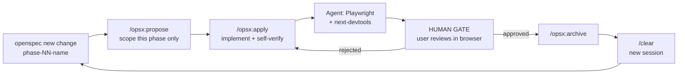

## Context

Phase 0 (design inventory) is complete; findings are in `openspec/reference/design-inventory.md`.
The design is finished and well-structured: 9 pages × 2 breakpoints × 2 locales = 36 frames,
plus real Figma component libraries on both canvases. Desktop pages run 1734–6448px tall.

The problem this change solves is sequencing. A single "build the website" task fails for
three compounding reasons: page frames are far too large for one session's context; shared
components (NAV, Footer, UniversalCTA, NewsletterSignup) appear on 6–9 pages each and will be
re-invented per page unless built first; and design tokens must exist before any component or
every section derives its own spacing and color.

## Goals / Non-Goals

**Goals**
- A phase decomposition where every phase output is a runnable, human-verifiable site.
- A hard approval gate between phases that is structural, not a rule an agent can rationalize past.
- Continuity across sessions without a narrative changelog nobody reads.
- CLAUDE.md corrected and kept small.

**Non-Goals**
- Writing any application code. Phase 1 does that.
- Specifying visual values. Those come from Figma MCP at implementation time, never from this doc.
- Locking the phase count. Phases 5..N are enumerated but may split as real heights are hit.

## Decisions

### Decision: layer-first phases, made verifiable by a `/styleguide` route

The user's constraint is that every phase produce something they can open and check. That
pushes toward page-first phasing, which is what causes token drift. A `/styleguide` route
resolves the conflict: token and primitive phases render onto it, so they are visually
verifiable against the Figma component frames without any real page existing yet.

**Alternatives considered:** page-first (rejected — every page re-derives tokens);
tokens-without-styleguide (rejected — violates the "verifiable output" constraint, the user
would be reviewing a diff instead of a browser).

`/styleguide` stays in the repo permanently as a regression surface, excluded from sitemap
and robots.

### Decision: i18n lands in Phase 1, not later

`app/[locale]/` must exist before any route is created. Retrofitting a locale segment means
touching every page, every link, every metadata export, and the font strategy (Latin and TC
subsets differ). See D001 in `openspec/DECISIONS.md`.

### Decision: one OpenSpec change per phase; the gate is structural

Each phase is its own change with its own `proposal.md` and `tasks.md`. A phase cannot run
past its boundary because the next phase's proposal does not exist yet. The gate is the
absence of instructions rather than a prohibition against acting — which is the only kind of
gate that survives an agent mid-flow.

Sequence per phase:

`/clear` between phases is deliberate: Phase 6 does not benefit from Phase 5's Figma payloads
and actively degrades from carrying them.

### Decision: three continuity artifacts, no narrative log

| Artifact | Answers | Why this and not a summary |
| :--- | :--- | :--- |
| `openspec/changes/*/tasks.md` + archived changes | What is done | Already the live progress state; archived changes are the permanent record. Free. |
| `app/_components/INVENTORY.md` | What already exists — do not rebuild it | The highest-value doc. Prevents the dominant multi-session failure: a fourth reimplementation of a shared component. |
| `openspec/DECISIONS.md` | Why it looks like this | Stops later phases re-litigating earlier ones. |

A per-phase prose summary is deliberately excluded — git history and archived changes already
cover it, and narrative docs get skimmed rather than read.

`INVENTORY.md` is created in Phase 1 and updated by every phase that adds a component. Updating
it is a task line in every phase's `tasks.md`, not an optional courtesy.

### Decision: fidelity tiers replace unbounded "pixel-perfect"

"Iterate until pixel-perfect" is unbounded and will burn a session closing a 3px gap on a
footer link list.

| Tier | Applies to | Bar |
| :--- | :--- | :--- |
| Exact | NAV, Home hero, UniversalCTA, Footer, all typography tokens | Spacing/size/color match; iterate until they do |
| Close | All other page sections | Visually indistinguishable at 100% zoom; stop at ≤4px drift |
| Derived | Tablet 768–1439px, hover/focus/motion not in the design | No Figma reference exists — follow D005 and ask rather than invent silently |

### Decision: sections, not pages, are the unit of work

Desktop Home is 6019px and News Details is 6448px. Any page over ~5000px splits across two
phases. Both breakpoints of a section ship in the same phase (D006).

## Phase Plan

| Phase | Name | Output | User verifies |
| :--- | :--- | :--- | :--- |
| 0 | Design inventory | ✅ Done — `openspec/reference/` | Reference docs match the Figma file |
| 1 | Skeleton, tokens, i18n | Runs; `/en` and `/zh` resolve; `/` redirects; `/styleguide` shows color/type/spacing ramps; fonts loaded for both scripts | Open `/styleguide` beside the Figma component frames; check `/` → `/en` |
| 2 | Primitives | CTA, Secondary CTA, Tag, Title Group, Tagline Wrapper, card shells — all on `/styleguide` | Every variant present, both locales |
| 3 | Shell | NAV (light + dark, EN + CN), Footer (EN + TC); all 9 routes exist as stubs × 2 locales | Click every nav link — nothing 404s; locale switcher works; nav at 393px and 1440px |
| 4 | Shared blocks | UniversalCTA, NewsletterSignup, Article card, MDX pipeline + `CMS` body renderer | Rendered on `/styleguide`; one sample MDX article renders |
| 5 | Home part 1 | 主視覺, 品牌聲明 | `/en` and `/zh` top half |
| 6 | Home part 2 | 專案精選, 核心服務, 行動呼籲 | `/en` complete |
| 7 | Our Story | Full page, both breakpoints | `/en/about` |
| 8 | Services part 1 | 首圖, 服務部分 | `/en/services` (6260px — split) |
| 9 | Services part 2 | 常見問題部分, 行動呼籲 | `/en/services` complete |
| 10 | Portfolio | Full page | `/en/portfolio` |
| 11 | Portfolio Details | Full page + real MDX content | `/en/portfolio/[slug]` |
| 12 | Featured Artists | Full page | `/en/artists` |
| 13 | News | Full page (6001px — may split) | `/en/news` |
| 14 | News Details | Full page (6448px — likely splits) | `/en/news/[slug]` |
| 15 | Contact | Full page + form submit target | `/en/contact` |
| F | Polish | Tablet audit, per-page metadata both locales, `hreflang`, a11y, asset export, Lighthouse | Resize sweep; view-source `<head>` |

Phases 5–15 may split further; the phase list is a plan, not a contract.

## Risks / Trade-offs

| Risk | Mitigation |
| :--- | :--- |
| ~~Figma MCP quota of 6 calls/month~~ | **Resolved 2026-08-01.** File copied into "Test Team" (Pro + Full seat) → 200/day, 15/min. Use file key `zSq5F5v3UrVAdIjuSipe3H`; node IDs verified identical to the original. |
| ~~Figma variables may not exist~~ | **Resolved — they exist.** Tokens pull mechanically via `get_variable_defs`. Partial set recorded in `design-inventory.md`; Phase 1 sweeps `COMP` for the remainder. |
| **No Traditional Chinese font is declared.** All three families in the design variables (Alumni Sans, Chivo Mono, Bodoni Moda SC) are Latin-only, yet half the site is Chinese. | Blocks Phase 1 font setup. Needs a user decision (task 6.1). Until chosen, `zh` pages will silently fall back to a system CJK font — which looks nearly right and is therefore easy to ship by accident. |
| TC layouts differ from EN by more than text (Featured Artists mobile: 5115px EN vs 3416px TC) | Every page phase checks the TC frame explicitly, not just the EN frame with swapped strings. |
| An agent implements the `archived` desktop section | Named as do-not-implement in both CLAUDE.md and `design-inventory.md`. |
| 16 phases is a lot of ceremony | The alternative is context exhaustion mid-page and silent quality collapse. Phases 5–15 are mechanical once 1–4 land. |

## Open Questions

| Question | Needed by |
| :--- | :--- |
| Do Figma variables exist in this file? | Phase 1 |
| Contact form submit target — Route Handler to email, or a third-party form service? | Phase 15 |
| NAV light/dark switch trigger — scroll position, or per-page static? | Phase 3 |
| Localized route slugs — staying English (D003)? Reversible only until Phase 3. | Phase 3 |
