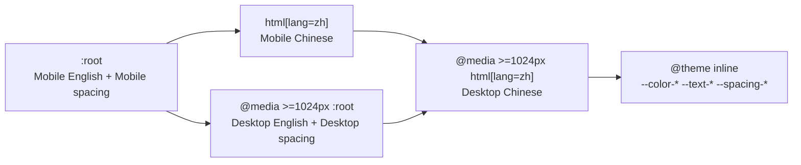

# Phase 1 Design — Skeleton, Tokens, i18n

## Context

See `proposal.md` → Why for motivation. The constraints that shape the approach:

- `openspec/reference/design-tokens.md` is already the complete Plugin API export. Text Styles
  carries four modes (`Mobile English`, `Mobile Chinese`, `Desktop English`, `Desktop Chinese`)
  and Spacing & Sizing carries two (`Desktop`, `Mobile`). Chinese is a genuinely different type
  scale, not a translation.
- The four text modes are exactly breakpoint × locale, so they need no runtime — but the width
  at which Mobile becomes Desktop is **not** in the variables. It is a derived decision this
  phase must make.
- Tailwind v4 is CSS-first: everything lives in `@theme` in `app/globals.css`; a
  `tailwind.config.ts` would be ignored.
- D007 forbids a theme system. D008 fixes the font strategy, including the one open piece it
  could not settle — an explicit CJK fallback for `Chivo Mono`.
- The site has no backend and no runtime fetching, so locale must resolve purely from route
  params (D001).

## Goals / Non-Goals

**Goals**

- One token definition that every later phase consumes without re-deriving anything.
- The four text modes resolved in CSS alone — no context provider, no client component, no
  JS-driven breakpoint.
- A missing translation that fails loudly, per the `localized-routing` spec, without adding a
  dependency.
- `/styleguide` reviewable against the Figma `COMP` frames while no real page exists.

**Non-Goals**

- Any primitive or shared component (Phase 2 and 3). The styleguide's own markup is not a
  component library and does not get an `INVENTORY.md` entry.
- A sitemap or `robots.txt` implementation. `/styleguide` carries page-level `noindex` now;
  sitemap exclusion is enforced when the sitemap is built in Phase F.
- Tablet layout. Nothing in this phase lays anything out.

## Decisions

### D009 — The Mobile→Desktop token switch is 1024px

`@media (width >= 1024px)`, matching Tailwind's `lg` and `Container/container-medium`.

**Alternatives considered.** 768px (`Container/container-small`, Tailwind `md`) — rejected:
the desktop display scale is far too large for a 768px viewport and would guarantee overflow
across the whole tablet range. 1280px (`container-large`) — rejected: safest for desktop
display type, but leaves 768–1279px rendering the mobile scale, an implausibly wide band of
phone-looking pages on laptops.

1024px is a compromise with a known cost: desktop display type is tight between 1024px and
1280px. The max-width tokens absorb most of it, and the residue is tablet behavior, which D005
already classifies as derived.

### D010 — Hand-rolled typed dictionaries, no i18n library

`app/_lib/i18n/` exports the locale tuple, a `Locale` type, a type guard, and per-locale
dictionary modules where `zh` is typed as `typeof en`.

**Why:** the spec's fail-loudly requirement is satisfied by the type checker — a missing key is
a `tsc --noEmit` error naming the key, which is stronger than any library's runtime warning.
The site is nine static pages with no plurals, no date/number formatting in the design, and no
runtime locale switching.

**Alternative considered:** `next-intl` — rejected. It brings middleware, a message catalog
format, and a provider for behavior this site does not have. Its main advantages (ICU
messages, formatters, locale negotiation) are all unused here.

### D011 — Root redirect via `next.config.ts`, not a root page

`redirects()` in `next.config.ts` sends `/` → `/en`. A root `app/page.tsx` calling `redirect()`
would work but would be a route outside `[locale]/`, which the project constraint forbids.
Config-level redirects also resolve before rendering, so nothing is generated for `/`.

`permanent: false` — a 301 is cached indefinitely by browsers and would make changing the
default locale effectively irreversible for returning visitors.

`/styleguide` remains the single sanctioned exception to the "no route outside `[locale]/`"
rule; it is already in CLAUDE.md's file structure and is not part of the public site.

### Token layering in CSS

Four cascade layers, in this order, then a single `@theme inline` block that maps them into
Tailwind's namespaces:

`@theme inline` is required rather than plain `@theme`: the mode-varying values must stay live
`var()` references so the cascade can re-resolve them, which `inline` preserves and a plain
`@theme` would flatten.

Colors are exposed to components at the **semantic** layer only (`Color Schemes`). Primitives
and the opacity ramps are declared as plain custom properties but are not surfaced as Tailwind
color utilities, so a component cannot reach past the semantic layer by accident.

Text styles map onto Tailwind v4's `--text-<name>` / `--text-<name>--line-height` /
`--text-<name>--letter-spacing` triple, so one utility carries size, leading, and tracking
together. Figma stores both leading and tracking as absolute px, not ratios or em.

Only the four padding tokens differ between the two spacing modes; containers and max-widths
are identical, so those are declared once outside the media query.

### `<html lang>` placement — corrected during implementation

The original plan below turned out to be impossible and was replaced; kept here so a later
phase doesn't re-propose it.

~~`<html>`/`<body>` move out of the root layout into `app/[locale]/layout.tsx`. The root layout
keeps global CSS. `/styleguide` needs its own document shell or a root-level fallback.~~

A single Next.js app has exactly one root layout that owns `<html>`/`<body>`, and `/styleguide`
shares no ancestor route segment with `/[locale]` — there is no "root layout" both branches
could nest under. The actual mechanism, confirmed against
`node_modules/next/dist/docs/01-app/03-api-reference/03-file-conventions/layout.md` →
"Root Layout" ("You can create **multiple root layouts**... Omitting `app/layout.js` so layouts
in subdirectories... each become root layouts for their respective directories"), is:

- No top-level `app/layout.tsx` at all.
- `app/[locale]/layout.tsx` and `app/styleguide/layout.tsx` are each an independent root
  layout, each defining its own `<html lang>`/`<body>`.
- Both import a shared `app/_lib/fonts.ts` (the `next/font/google` calls live in one place,
  per Next's guidance not to redeclare the same font in multiple files) and the same
  `app/globals.css`.
- `app/[locale]/layout.tsx` sets `lang` from the resolved route param; `app/styleguide/layout.tsx`
  hardcodes `lang="en"` since it isn't locale-routed — the page itself renders its Chinese
  specimens inside an explicit `lang="zh"` wrapper (task 6.4).

This is a genuine "multiple root layouts" site, not a workaround — the documented trade-off is
a full page load (not a client-side transition) when navigating between the two branches, which
is irrelevant here since nothing links from a page into `/styleguide`.

## Risks / Trade-offs

| Risk | Mitigation |
| :--- | :--- |
| **`html[lang="zh"]` (0,1,1) outranks `:root` (0,1,0) regardless of source order.** A desktop override written only under `:root` inside the media query will never apply on `/zh`. The failure is silent — Chinese desktop type merely looks slightly small. | The desktop block re-declares the Chinese values under `html[lang="zh"]` as well. Verified explicitly at 1440px on `/zh`, not inferred. |
| TC font subsets are very large and `next/font/google` will inline them into the critical path | `preload: false` and `display: swap` on the Traditional Chinese faces; preload stays on the Latin faces. Confirm the actual subset names each family ships — a subset that does not exist fails the build. |
| Mochiy Pop One ships Regular only, and Noto Serif TC has no italic | Accepted by D008 — declare the weight/style and let the browser synthesize, matching how Figma faux-bolds. Not an implementation bug; do not "fix" it. |
| Chinese body copy has no designed typeface (Chivo Mono has no CJK coverage) | D008 — the body stack names an explicit CJK fallback so the result is deterministic rather than per-OS. |
| 1024px leaves desktop display type tight until 1280px | Accepted (D009). Falls under D005's derived-tablet rule; revisit only with a real tablet design. |
| The styleguide is hand-written markup that could drift into becoming Phase 2's component library | It renders tokens only. Any primitive belongs to Phase 2 and to `INVENTORY.md`. |
