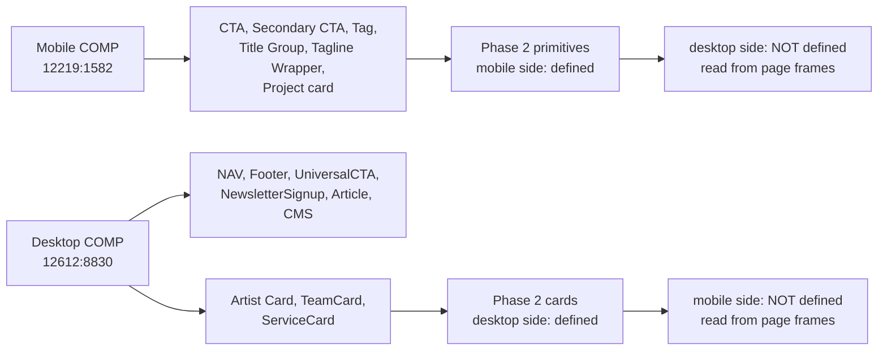

## Table of Contents

- [Context](#context)
- [Goals / Non-Goals](#goals--non-goals)
- [Decisions](#decisions)
  - [D-A: Desktop appearance is derived from occurrences, and the choice is recorded](#d-a-desktop-appearance-is-derived-from-occurrences-and-the-choice-is-recorded)
  - [D-B: Component API — locale prop, variant prop, no context](#d-b-component-api--locale-prop-variant-prop-no-context)
  - [D-C: Card shells ship as shells, not as data-bound cards](#d-c-card-shells-ship-as-shells-not-as-data-bound-cards)
  - [D-D: Buttons are polymorphic over `<a>` and `<button>`](#d-d-buttons-are-polymorphic-over-a-and-button)
  - [D-E: Tablet behavior for primitives](#d-e-tablet-behavior-for-primitives)
  - [D-F: Interaction states are derived, and minimal](#d-f-interaction-states-are-derived-and-minimal)
  - [D-G: Styleguide specimens are split out of `page.tsx`](#d-g-styleguide-specimens-are-split-out-of-pagetsx)
- [Figma Fetch Plan](#figma-fetch-plan)
- [Risks / Trade-offs](#risks--trade-offs)
- [Open Questions](#open-questions)

## Context

See `proposal.md` — Why. The constraint that shapes everything below was found during
proposal-time metadata sweeps of both `COMP` sections:

Worse than "no component definition": a spot check of the desktop `UniversalCTA`
(`12573:9014`) shows its call-to-action is a locally-drawn `Button` frame (`12573:6408`,
174×45, hug width) — **not an instance of the mobile `CTA` symbol** (363×45, fill width). The
two canvases were drawn independently. There is no guarantee that two desktop pages draw the
same button the same way, and nothing in the file would flag it if they did not.

Everything else this phase needs already exists: tokens in `@theme` (Phase 1), the `[locale]`
tree, and `/styleguide` with its own root layout.

## Goals / Non-Goals

**Goals:**

- One responsive React component per primitive, correct at 393px and 1440px in both locales.
- A written, checkable record of which Figma node each component's desktop (or mobile)
  appearance was derived from, so a later phase can audit rather than re-derive.
- `/styleguide` extended into a real regression surface without becoming an unreadable file.

**Non-Goals:**

- Any page section, page layout, or real content. Cards get sample props, not MDX.
- `NAV`, `Footer`, `UniversalCTA`, `NewsletterSignup`, `Article`, `CMS` — Phases 3 and 4.
- Animation and scroll behavior. `FluidBackground` and `RevealHeading` inside UniversalCTA
  are motion work owned by Phase 4.
- New design tokens. If a primitive appears to need a value absent from
  `openspec/reference/design-tokens.md`, that is a signal to re-read the reference, not to add
  a raw value.

## Decisions

### D-A: Desktop appearance is derived from occurrences, and the choice is recorded

The desktop side of the six mobile primitives (and the mobile side of the three desktop cards)
comes from occurrences inside page frames. Because those occurrences are not instances of a
shared symbol, the procedure is:

1. Survey **at least two** occurrences of the primitive across different desktop page frames.
2. If they agree, implement that and record the node ID surveyed.
3. If they disagree materially — different height, padding, type token, or fill — **stop and
   ask the user** before picking. Record the answer in `openspec/DECISIONS.md`.
4. If they disagree trivially (≤4px, the `Close` fidelity tier), pick the occurrence from the
   page that uses the primitive most, and record both node IDs plus the drift observed.

Every component file carries a header comment naming the exact node IDs its mobile and desktop
appearances came from. This is the audit trail; without it Phase 10 has no way to tell a
deliberate choice from a mistake.

**Alternative considered:** treat the mobile symbol as canonical and scale it up for desktop.
Rejected — the UniversalCTA button is hug-width where the mobile CTA is fill-width, so the
desktop design is not a scaled mobile design and scaling would be visibly wrong.

**Alternative considered:** defer desktop entirely to the page phases. Rejected by the user,
and it violates D006.

### D-B: Component API — locale prop, variant prop, no context

Every primitive takes `locale: Locale` explicitly and a `variant` union where the design
defines one. No React context, no client-side locale store — required by D001 and by the
`design-primitives` spec.

The `Default` / `TC` Figma variants are **not** two components and **not** two style branches
in TypeScript. Chinese type sizing already flows from `html[lang="zh"]` in `globals.css`
(Phase 1); the `locale` prop exists for content and for the rare case where the TC variant
changes layout rather than just type. Where the only difference between `Default` and `TC` is
the type scale, the component needs no conditional at all — verify this per primitive rather
than assuming it, since Featured Artists proves TC layouts do sometimes genuinely differ.

`Tag`'s `Default` / `Active` is a real prop, because the caller decides it (spec: "A
primitive's designed states are distinguishable").

### D-C: Card shells ship as shells, not as data-bound cards

`ProjectCard`, `ArtistCard`, `TeamCard`, and `ServiceCard` take presentational props (title,
image, tags, and so on) supplied by the caller. They do not read MDX, do not know about routes,
and do not fetch. Images are `next/image` with real exported assets where a card's design is
meaningless without one; otherwise a neutral placeholder block sized to the design.

`ServiceCard` (`12600:7460`) is 1440×647 — a full-bleed band, not a card. This phase ships its
shell and its internal composition only. No Services page grid, no accordion, no section
padding. Recorded as a scope boundary because the name invites the opposite reading.

### D-D (addendum): `Cta` carries a `tone` prop

Resolved by the user 2026-08-01 after the occurrence survey found a material color conflict
(see Derived Sources). `Cta` takes `tone: 'dark' | 'green'`, default `'dark'`. `SecondaryCta`
takes the analogous `tone: 'dark' | 'light'`, default `'dark'` — the same background-adaptation
pattern turned up for it once the survey covered `ServiceCard`'s nested instance, so it is
applied consistently rather than treated as a second open question.

### D-D: Buttons are polymorphic over `<a>` and `<button>`

`Cta` and `SecondaryCta` render an `<a>` when given an `href` and a `<button>` otherwise. Most
uses are navigation; the contact form in Phase 15 needs a submit button with identical styling.
Building one polymorphic component now avoids a near-duplicate later.

**Alternative considered:** always render `<button>` and wrap in `<Link>`. Rejected — nested
interactive elements, and it breaks middle-click and "open in new tab".

### D-E: Tablet behavior for primitives

Primitives are small enough that the 768–1439px band is a genuine interpolation for most of
them, so D005's "stop and ask" trigger does not fire: buttons keep their intrinsic size, tags
and title groups reflow with their container.

The exception is anything that is **fill-width on mobile and hug-width on desktop** — the CTA
is already known to be one. That switch needs a width to happen at. It happens at the same
1024px boundary as the token mode switch (D009), so a primitive never renders desktop type at
mobile proportions or the reverse. This gets appended to `DECISIONS.md`.

Card shells are the other exception: they are fixed-width in the design (Artist Card 320px,
TeamCard 284px, Project card 353px). The **card** is fixed-width and stays so; how many fit per
row is a grid decision belonging to the page phase that lays them out, not to this phase.

### D-F: Interaction states are derived, and minimal

The design defines no hover, focus, or pressed state for any primitive — only `Tag`'s `Active`,
which is a caller-set state, not an interaction. Rather than invent a visual language, this
phase ships the minimum that keeps the site usable and accessible:

| State | Treatment |
| :--- | :--- |
| Hover | A single opacity or brightness shift, identical across all interactive primitives |
| Focus | Visible `focus-visible` ring using an existing brand token — never `outline: none` |
| Active/pressed | None |
| Motion | None. Transitions are Phase F or a page phase, not here. |

Deliberately uniform and dull: a later phase can replace it in one place. Recorded in
`DECISIONS.md` as derived, and it must not be reported as matching the design.

### D-G: Styleguide specimens are split out of `page.tsx`

`app/styleguide/page.tsx` is 241 lines after Phase 1 and will grow through Phases 3, 4, and F.
Specimen rendering moves into `app/styleguide/_components/`, one file per group (tokens,
primitives, cards), with `page.tsx` reduced to composition. Done now while the file is still
small.

The primitives section renders each component twice — once plain and once inside a `lang="zh"`
wrapper — reusing the pattern Phase 1 established for the TC type specimens.

## Figma Fetch Plan

Per CLAUDE.md, `/figma-design-to-code` runs first, then fetches. Budget is 200 calls/day; this
plan is roughly 30, so quota is not a constraint.

| Step | Nodes | Tool |
| :--- | :--- | :--- |
| 1 | Mobile primitive definitions: `12368:4718`, `12368:4721`, `12219:1180`, `12219:946`, `10270:2179`, `10274:2306` | `get_design_context` + `get_screenshot` |
| 2 | Desktop card definitions: `12592:6786`, `12610:6405`, `12600:7460` | `get_design_context` + `get_screenshot` |
| 3 | Locate desktop occurrences of the mobile primitives — start from Portfolio `12612:8704` (tags, project cards), Home `12405:6998` (title groups, tagline wrapper, CTA), UniversalCTA `12573:9014` (CTA, confirmed present) | `get_metadata` to locate, then `get_design_context` on the occurrence |
| 4 | Locate mobile occurrences of the three cards — Featured Artists `12211:3608`, Our Stories `12210:2817`, Services `12220:2064` | same |
| 5 | TC counterparts wherever step 3 or 4 found a layout difference, not merely different text | `get_design_context` |

Step 5 is conditional on purpose. Fetching all four frames for every primitive is the CLAUDE.md
rule for a *section*; for a button it is waste. The rule that matters is the one behind it —
never assume TC is EN with swapped strings — so the trigger is "the TC frame's geometry
differs", checked cheaply via `get_metadata` first.

## Derived Sources

Audit trail for D-A. "Conflict" means a difference beyond hug-width padding varying with
label text length, which is expected and not recorded as drift.

| Component | Mobile source | Desktop source(s) surveyed | Finding |
| :--- | :--- | :--- | :--- |
| `Cta` | `12368:4718` (fill-width 363px, dark bg/white text) | `12573:9014` (UniversalCTA, hug, dark/white), `12405:6975` (Home Hero, hug, dark/white), `12358:2031` (Home Featured Projects preview, hug, **green bg/dark text**) | **Material conflict — user decision 2026-08-01.** Desktop is hug-width, not fill (D-E). Fill color is not uniform: two occurrences are dark/white, one is green/dark. Shipped as a `tone: 'dark' \| 'green'` prop, default `'dark'` (matches mobile). Both render on `/styleguide`. |
| `SecondaryCta` | `12368:4721` (fill-width 363px, dark outline/dark text — for light backgrounds) | `12220:2696` → nested instance (`I12220:2696;12220:2660`, hug, **white outline/white text**, sitting on ServiceCard's dark panel); same white treatment also found inside desktop ServiceCard `12593:7447` | **Same tone-adaptation pattern as `Cta`, not a separate conflict.** Applying the already-approved fix rather than re-asking: `SecondaryCta` also takes a `tone: 'dark' \| 'light'` prop (`'dark'` = dark outline/text for light backgrounds, matches mobile `Default`; `'light'` = white outline/text for dark surfaces like `ServiceCard`). |
| `Tag` | `12219:1180` (`Default`/`Active`, outlined chip) + `10274:2297` (colored chip inside Project card, no border) | `12220:1061`–`1064` (Featured Artists filter row, same 146×32.57 / 125×32.57 sizing as mobile) | No conflict — same component, same sizing at desktop widths. |
| `TitleGroup` | `12219:946` (rotated tagline + plain white/dark H2) | `12405:6424` (Home Hero "Heading 2" — same structure, but heading text uses a **green gradient fill**, not a flat color) | **Judgment call, not asked** — the gradient is decorative and Home-Hero-specific (Exact-tier, page-owned per CLAUDE.md), not a token in design-tokens.md. `TitleGroup` ships with the flat-color treatment every other occurrence uses; a gradient is a `className` override the Home page phase (5) applies on top, not a primitive concern. |
| `TaglineWrapper` | `10270:2179` (vertical, rotated 90°, green dot + label) | Confirmed nested identically inside `TitleGroup` (`12405:6427`) and `ServiceCard` (`I12220:2696;12220:2746`) | No conflict. No standalone horizontal occurrence was found anywhere surveyed — the Open Question in the proposal is resolved: no horizontal variant is needed this phase. |
| `ProjectCard` | `10274:2306` (353×682, single column) | `12610:6812` (Portfolio grid, 325×624, 3-up) | No conflict — same content model and tokens; width is fixed-per-breakpoint per D-E, not a style difference. |
| `ArtistCard` | none (desktop-only definition) | mobile occurrence `12220:1114` (176.5×403, 2-up grid on Featured Artists) vs. desktop definition `12592:6786` (320×550) | No conflict — same structure (image, name, genre, bio, social row), fixed width scales down for mobile's 2-column grid. |
| `TeamCard` | none (desktop-only definition) | mobile occurrence `12217:886` (284px wide, `pr-[11px]`, image 183×246) vs. desktop definition `12610:6405` (284px wide, `pr-[21px]`, image 284×368) | Trivial drift (≤4px tier per D-A step 4) — card width is identical (284px) at both breakpoints; only the right-padding (11px vs 21px) and image aspect differ slightly. Desktop definition (`12610:6405`) implemented as canonical; mobile occurrence's tighter padding is the observed drift, not reproduced separately. |
| `ServiceCard` | none (desktop-only definition) | mobile occurrence `12220:2696` ("Service" — same content model: numbered tagline, title, body, feature list, Secondary CTA) vs. desktop definition `12600:7460` (split image+list layout) | No conflict — same content model. Desktop splits image and text side-by-side (1440×647); mobile stacks image above text. Ordinary responsive reflow of one shell, not two designs. |
| `Article` | mobile occurrence `12220:1670` (News page, stacked column: tag+date row, `Display/H5` title, then a full-width image below, border-top divider) | `12612:7696` (desktop definition: horizontal split, text column `flex-1` with border-top on the left, fixed `419×350` image on the right, `Display/H4` title) | No conflict — same content model (tag, date, title, image), same border-top treatment. Desktop splits side-by-side; mobile stacks with the image last instead of first (unlike `ProjectCard`, which puts the image before the description) — reproduced as designed, not normalized to match `ProjectCard`'s ordering. |

## Risks / Trade-offs

| Risk | Mitigation |
| :--- | :--- |
| **Desktop occurrences of the same primitive disagree with each other.** Already likely: the desktop button is drawn locally, not instanced. | D-A's survey-two-then-ask procedure. A material conflict is a user question, not an agent judgment call. |
| A primitive shipped here turns out wrong when Phase 5 first composes it, forcing a rework of every consumer | Card shells stay presentational (D-C), so a fix is a style change in one file. The header comment naming source nodes makes the original derivation auditable rather than mysterious. |
| `ServiceCard` drags Services page layout into this phase | Named as a scope boundary in D-C and as an out-of-scope line in the proposal. Ships as a shell on `/styleguide` only. |
| Interaction states invented here calcify into "the design" | D-F keeps them deliberately uniform and records them as derived in `DECISIONS.md`. |
| `/styleguide` becomes a page nobody can read, defeating the human gate | D-G's split, plus grouping specimens so a reviewer can compare against one Figma frame at a time. |
| Nine components in one phase is a lot | They are small and independent. If the session runs long, the ordering in `tasks.md` finishes the six mobile primitives before the three cards, so a partial phase still ships a coherent, reviewable set — and says so plainly rather than reporting the phase complete. |

## Open Questions

| Question | Safe to defer because |
| :--- | :--- |
| Do any of the four cards need a hover treatment richer than D-F's uniform one? | Cards are not interactive until a page phase gives them a link. The decision belongs to the phase that does. |
| Does `Tagline Wrapper` need a horizontal variant at desktop? | Unknown until step 3 of the fetch plan locates a desktop occurrence. If it does, it is a variant prop — additive, and it changes no spec and no other task. |
