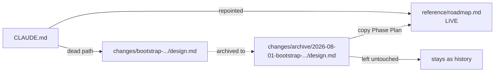

# Phase 07a — Design Notes

Only the choices this phase is forced to make. Everything else is mechanical correction.

## Table of Contents

- [D-A: The roadmap is promoted, not rewritten in place](#d-a-the-roadmap-is-promoted-not-rewritten-in-place)
- [D-B: `specs/` scope — pages are not capabilities](#d-b-specs-scope--pages-are-not-capabilities)
- [D-C: The Footer "Contacts" drift](#d-c-the-footer-contacts-drift)
- [D-D: Stale facts are corrected in place, not annotated](#d-d-stale-facts-are-corrected-in-place-not-annotated)
- [Open questions for the user](#open-questions-for-the-user)

## D-A: The roadmap is promoted, not rewritten in place

**The conflict.** An archived change is history — the archive guidance says so, and
`DECISIONS.md` opens with "append only — do not rewrite history". But the Phase Plan table
inside the archived `bootstrap-site-build-process/design.md` is the opposite of history: it
is the only forward-looking document in the repo, and it says of itself that phases "may
split further; the phase list is a plan, not a contract". A plan that must evolve cannot
live in a file that must not change.

**Decision.** Copy the Phase Plan table into a new `openspec/reference/roadmap.md`. Leave
the archived `design.md` byte-for-byte unchanged. Repoint `CLAUDE.md` at the new file and
add it to the "Read These First" table.

**What the roadmap carries that the archived table did not:**

| Column | Why |
| :--- | :--- |
| Status | Phases 0–7 are done; the archived table only marks Phase 0 |
| Change id | The archived directory name, so a phase can find its predecessor's decisions |
| Inherited work | Forward-phase tasks currently hiding in `INVENTORY.md` rows |

**What it must not carry.** The archived design.md's Risks and Open Questions tables. Three
of its four open questions are answered and two of five risks are resolved; copying them
forward would recreate exactly the drift this phase is correcting. Answered questions live
in `DECISIONS.md`.

**Updating it becomes a phase task line**, the same standing obligation `INVENTORY.md` and
`DECISIONS.md` already carry. Without that, the roadmap drifts within two phases and we have
achieved nothing.

## D-B: `specs/` scope — pages are not capabilities

**The observation.** `openspec/specs/` holds three capabilities — `design-primitives`,
`localized-routing`, `mdx-content` — contributed by Phases 1–4. Phases 5, 6 and 7 shipped
Home and Our Story in full and contributed nothing. The spec layer stopped tracking reality
three phases ago and nobody noticed, which is the strongest available evidence about what it
is actually for on this project.

**This is not a failure.** `config.yaml` already says it: *"Behavioral requirements only —
routing, locale resolution, content loading, form submission, build-time failures. Visual
appearance is not a spec; the Figma file is its source of truth."* Page phases produce
visual appearance. They correctly have nothing to say.

| Option | Consequence |
| :--- | :--- |
| **A. Accept — pages are not capabilities** (recommended) | `specs/` covers routing, content, and primitives only. Page phases keep `skip_specs: true`. Write it down so Phase 8 stops wondering. |
| B. Add a `page-composition` capability | One spec asserting every page renders at both breakpoints in both locales. Gives archive-time validation something to check — but it is a restatement of the phase process, not a requirement the design does not already make. |
| C. Retire `specs/` for this project | Honest about current practice, but throws away the one mechanical check that exists for the routing and MDX layers, which genuinely do have behavior. |

**Recommendation: A**, recorded as a new decision in `DECISIONS.md`. This is a static
marketing site; forcing specs onto layout work produces ceremony, not safety. Phases 15
(contact form) and F will have real behavior again and can add specs then.

**This needs the user's call** — see Open questions.

## D-C: The Footer "Contacts" drift

`routes.md` has recorded, for five phases, that the Footer's page-links column reads
"Contacts" where the NAV reads "Contact Us", and that this is "unresolved". A drift left
open across five phases is not open, it is accepted by default — the only question is
whether the docs admit it.

Two ways to close it, and it must be closed one way or the other:

| Option | Action |
| :--- | :--- |
| **Resolve** | The NAV is already the canonical link label and `Footer.tsx` renders from the same `routes.ts` entry, so the site is already consistent. Delete the paragraph as obsolete. |
| **Accept** | If the Figma Footer frame genuinely shows "Contacts" and we are deliberately ignoring it, that is a decision — move it to `DECISIONS.md` and out of `routes.md`. |

The phase must verify which is true against `Footer.tsx` and the Figma frame `12573:9181`
before choosing. It is a one-line read, not a research task.

## D-D: Stale facts are corrected in place, not annotated

The reference files are **not** append-only — only `DECISIONS.md` is. So a wrong fact gets
**deleted and replaced**, not struck through with a note. `design-inventory.md`'s Open
Questions table already demonstrates the failure mode of the alternative: it is four rows of
`RESOLVED`/`DONE` annotations wrapped around three rows that are still wrong, and the noise
is exactly why nobody re-read it for seven phases.

Where a correction has a governing decision, the replacement text **cites the decision id**
(`D040`, `D050`, `D008`) rather than restating its reasoning. One fact, one home.

## Open questions for the user

| # | Question | Recommendation |
| :--- | :--- | :--- |
| 1 | **`specs/` scope — A, B, or C** (D-B)? | **A** — accept that pages are not capabilities, record it as a decision |
| 2 | **Footer "Contacts"** — resolve as obsolete, or accept as a deliberate divergence (D-C)? | Verify against `Footer.tsx` + `12573:9181` first; expect "resolve as obsolete" |

Neither blocks the other eight corrections. If unanswered, the phase completes items 1–6 and
8 and stops at these two rather than guessing.
