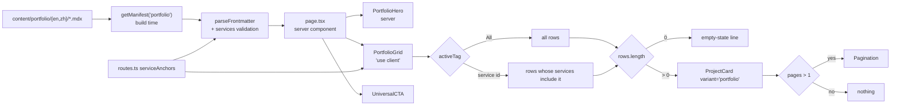

# Phase 10 — Portfolio: Design

## Table of Contents

- [Context](#context)
- [Goals / Non-Goals](#goals--non-goals)
- [Decisions](#decisions)
- [Data flow](#data-flow)
- [Risks / Trade-offs](#risks--trade-offs)
- [Open Questions](#open-questions)

## Context

See `proposal.md` → *Why*. Three constraints shape the approach:

1. **The route this page lists into already works.** `app/[locale]/portfolio/[slug]/page.tsx`
   and the `content/` manifest shipped in Phase 4, with one seeded entry. This page is the
   missing listing, not a new content pipeline.
2. **Every interaction on the page is undesigned.** Filtering, the empty state, pagination
   behaviour, and hover all have no prototype. Figma draws one static state.
3. **The page is a server component that must host client state.** The grid filters and
   paginates in the browser; the manifest is read at build time on the server.

## Goals / Non-Goals

**Goals:**

- One responsive `ProjectCard` serving both its orderings through a prop, per the roadmap's
  Inherited Work row.
- A filter whose tag set cannot drift from the four service lines already declared in
  `routes.ts`.
- Project data that Phase 11 extends rather than replaces.

**Non-Goals:**

- URL-synced filter state (`?filter=`). Not designed, not asked for, and it would make the
  page's canonical URL ambiguous for the `hreflang` pairs Phase F audits.
- Filter *combinations*. Figma draws a single-select row; multi-select is an invention.
- Sorting controls, search, or an animated grid transition.
- Anything Phase 11 owns — bodies and the share rail. **Imagery is no longer deferred**: the
  real project posters turned out to be embedded in the Figma cards, so they ship here (user
  decision, task 1.4 gate) rather than leaving three grey boxes at the review.

## Decisions

### D-A: Grid data comes from the MDX manifest, not a `projects.ts`

**Chosen:** `getManifest('portfolio')` in the server page, passed to the client grid as plain
props.

**Alternative rejected:** a `app/_lib/projects.ts` mirroring `team.ts` (Phase 7's precedent).
`team.ts` is right for team members — they have no detail page and never will. Projects have
a live detail route and MDX files that already exist. A parallel array would need Phase 11 to
delete it and re-key every card, and until then the listing and the detail page could
disagree about a project's title.

**Consequence:** the client grid receives serialisable rows only (`slug`, `title`, `date`,
`excerpt`, `services`) — never the `Body` component, which is not serialisable across the
server/client boundary.

### D-B: `services` is validated per content type, in the existing guard

`parseFrontmatter` gains a content-type argument and a fourth field checked only for
`portfolio`. Values must be `serviceAnchors` ids; an unrecognised id throws naming the file
and the id.

**Alternative rejected:** a separate `parsePortfolioFrontmatter`. Two guards over three shared
fields duplicates the error-message work D-B of Phase 4 deliberately centralised, and news
would drift the moment it gained its own field.

**Alternative rejected:** free-text tags. The filter row and the Services page would then
carry two independent lists of the same four names — exactly the drift D077 closed for the
Footer.

### D-C: `ProjectCard` takes `variant`, and the variant swaps the whole card body

**Amended during implementation.** The original wording claimed the two cards are the same
elements in a different sequence. The `get_design_context` diff at task 1.4 disproved it. The
real differences against the shipped component:

| Aspect | `home` (shipped) | `portfolio` (`12610:6812`) |
| :--- | :--- | :--- |
| Order | tags → title → date → image → description | image → tags → title → date → description |
| Image | `aspect-[333/445]`, inset inside the card padding | fixed 352.386px tall, full-bleed to the card edge |
| Padding | one `px-[10px] py-[13px]` box | `p-[0.542px]` card + `px-[12px] py-[20px]` content block |
| Block gap | 15px | 16px, description on its own `pt-[8px]` |
| Title / description | `text-4xl` / `text-xs`+20 | Accent/Display 37/37 / Body/S 13/19.5 |

The type deltas are ≤1px and fall inside the Close tier. The load-bearing differences are the
full-bleed fixed-height image and the card-vs-content-block padding split — a different
layout, not a reordering.

**Still one prop** (user decision, task 1.4 gate). Two facts make that hold: desktop
`12610:6812` and mobile `12219:1187` are structurally identical, differing only in the card
width the caller sets — so the portfolio variant is a single non-responsive tree, not a
breakpoint pair; and the prop selects a whole body layout rather than composing independent
booleans, so there is no second axis to grow.

**Alternative rejected:** a separate `PortfolioCard`. INVENTORY.md and the roadmap both
pre-committed to a prop, and a second component forks every future card fix.

**Alternative rejected:** an `lg:` switch. Explicitly ruled out by the Inherited Work row —
the two layouts are per-*page*, not per-breakpoint. The Portfolio card is image-first at
393px too.

### D-D: The filter is client state in one component; the page stays a server component

`PortfolioGrid` is the only `'use client'` boundary. It owns the active tag and the page
index, and it renders the cards, the empty state, and the paginator — because all three are
functions of the same two pieces of state, and splitting them would mean lifting state into a
third wrapper for no gain.

`PortfolioHero` and the page itself stay server components.

**Interaction semantics** (all derived — no prototype exists on this frame, confirmed the way
Phase 9 confirmed the FAQ's absence):

| Aspect | Behaviour |
| :--- | :--- |
| Selection | Single-select, `All` active on load |
| Re-click active tag | No-op; `All` is the only way back |
| Page index on filter change | Resets to 1 |
| Motion | None. The grid re-renders; it does not animate. D041's 300ms is a disclosure timing and does not transfer. |
| Keyboard | Tags are `<button>`s in a `role="group"`; native tab order, no roving tabindex — five controls do not justify one |
| Announcement | The grid region is `aria-live="polite"` so a filter change is announced |

### D-E: The paginator renders nothing below two pages

Page size comes from the drawn grid, which disagrees with itself — 11 desktop slots against 5
mobile. Neither is a project count and neither is a page size the design states. The page size
is therefore **derived**: one value, applied at both breakpoints, chosen at implementation
time from the desktop grid's row rhythm.

With three projects there is one page, so the row does not render. This is the honest
reading: Figma draws page 10 of a 10-page set, which is sample data in exactly the way the
breadcrumb's "Bottom's Up" is. Rendering an inert `1 … Next` would be inventing a state the
design does not draw, and the alternative — omitting the component — loses work Phase 11 needs
the moment a fourth project lands.

**Consequence the gate must know:** the paginator ships built and unverifiable in the browser.
Its Figma match is checked by temporarily lowering the page size during self-verification, and
that check is reported as a temporary-state screenshot, not as a page state the user can reach.

### D-F: Empty state is a line of copy, not disabled tags

`藝人經紀 / Artist Management` matches none of the three projects. Disabling tags with zero
matches would make the filter row's contents depend on which projects happen to exist — the
row would change shape when Phase 11 adds a project, and a user could never see the full set
of service lines the page is advertising.

A localized line in the grid area keeps the row stable and states the real situation. It lives
in the i18n dictionary, not inline.

### D-G: Tablet (768–1439px) is the mobile design at a wider viewport

Same derivation Phase 8 made for Services (D072): the grid stays single-column and the filter
row stays stacked above it until 1024px, where `Nav` already switches. Above 1024px the
desktop two-column split applies and the grid interpolates from 3-up. The one interpolation
this phase must make deliberately is **3-up → 2-up**, which CLAUDE.md flags as a
stop-and-ask case rather than a trivial interpolation.

Above 1024px the desktop two-column split applies and **the grid stays 3-up all the way down
to 1024px, with fluid columns** (user decision, propose gate): the 320px filter rail and the
1024px grid both shrink proportionally rather than the grid dropping a column. Chosen over a
2-up band because it adds no breakpoint the design does not draw. The cost is narrow cards
near 1024px, which Phase F's tablet audit inherits.

## Data flow

## Risks / Trade-offs

| Risk | Mitigation |
| :--- | :--- |
| The two card orderings differ by more than sequence, making `variant` a leaky prop | Confirm against `get_design_context` for `12610:6812` and Home's `12210:2404` **before** writing the prop. A second difference is a finding to report at the gate, not a second boolean. |
| Adding a required-ish field to shared frontmatter breaks the existing news entry or the seeded portfolio entry | `services` is validated for `portfolio` only, and the one existing portfolio file is edited in the same commit. `npx tsc --noEmit` plus a dev-server load of both detail routes catches it. |
| Page totals drift from the frames because the cards are content-driven | Expected and precedented (D066, and the Phase 9 finding that the whole Services page drifts for this reason). Measure each *section* against its frame, not the page total, and report the total as information. |
| The paginator ships unverified by the user | Flagged in the proposal's *User verifies* list as an explicit absence, and self-verified with a temporarily lowered page size. Reported as such — not as "matches the design". |
| English project copy is AI-generated and could be mistaken for client copy | Kept in the matrix's outstanding-copy table and called out in the gate report. |

## Open Questions

None. The one derivation this phase had to make — the 1024–1439px grid band — was resolved at
the propose gate and is recorded under D-G. It gets a `DECISIONS.md` entry during
implementation.
