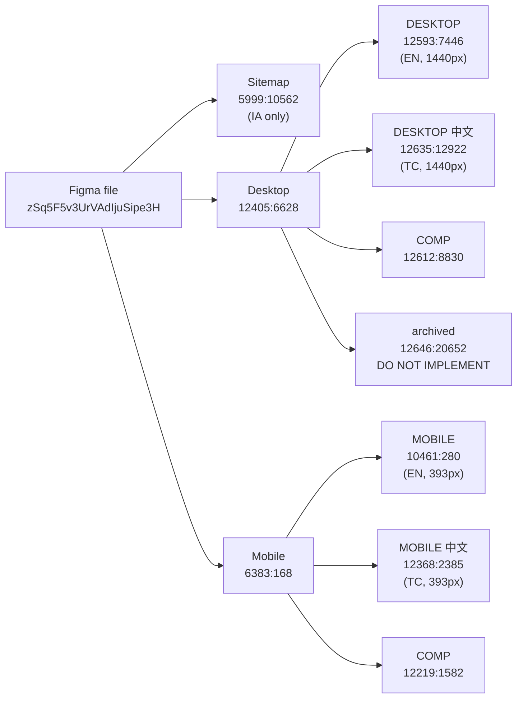

# Figma Design Inventory — In Utero Website

Extracted 2026-08-01 from Figma file **`zSq5F5v3UrVAdIjuSipe3H`** (子皿網站UI -Copy-).

**Use this file key, not the original.** The source file `7uC2EQp61AsMp8ebZQcI7w` lives on a team
where the account holds only a View seat (6 MCP calls/month). This copy lives in "Test Team"
(Pro + Full seat, 200 calls/day). Node IDs were verified identical across both files on
2026-08-01, so every ID in this document is valid.
This document is the map of the design file. It records **what exists and where**,
so no phase has to re-discover the file structure. It does not record visual values —
always call the Figma MCP tools for the node you are implementing.

## Table of Contents

- [File Layout](#file-layout)
- [Do Not Implement](#do-not-implement)
- [Page Frames](#page-frames)
- [Shared Components — Desktop](#shared-components--desktop)
- [Shared Components — Mobile](#shared-components--mobile)
- [Breakpoints](#breakpoints)
- [Bilingual Structure](#bilingual-structure)
- [Design Tokens](#design-tokens)
- [Assets](#assets)
- [Open Questions](#open-questions)

## File Layout

The file has three canvases. Only two contain the UI.

| Canvas | Node ID | Contents |
| :--- | :--- | :--- |
| Sitemap | `5999:10562` | Information architecture only — page/section outline with Chinese descriptions. No visual design. |
| Desktop | `12405:6628` | `DESKTOP`, `DESKTOP 中文`, `COMP`, `archived` sections |
| Mobile | `6383:168` | `MOBILE`, `MOBILE 中文`, `COMP`, plus `ref`/`photo` scratch sections |

## Do Not Implement

| Node | Why |
| :--- | :--- |
| `12646:20652` — desktop `archived` section | Superseded designs (an old Hero, Intro, and ServicesAccordion). A broad metadata sweep will surface these; they are not the current design. |
| `10268:1854` — mobile `ref` section | Image reference/moodboard scraps. |
| `10270:2212` — mobile `photo` section | Loose photography, not a layout. |

## Page Frames

Nine pages, each existing at two breakpoints × two locales = 36 frames.

> **The names below are Figma frame names, not page names.** They are recorded only so you can
> find the frame in the file. Three disagree with the page's real name and are marked **†**.
> **Never copy a frame name into UI copy, a nav label, or metadata** — page names come from
> `app/_lib/routes.ts` (D018), documented in `openspec/reference/routes.md`. The **Route**
> column here is canonical.

| Route | Desktop EN | Desktop TC | Mobile EN | Mobile TC |
| :--- | :--- | :--- | :--- | :--- |
| `/[locale]` | Home `12405:6998` | `12635:15868` | Home `10268:2046` | `12368:2413` |
| `/[locale]/about` | Our Story `12612:8545` | `12635:12924` | Our Stories **†** `12210:2817` | `12368:2432` |
| `/[locale]/services` | Services `12612:8668` | `12635:12925` | Services `12220:2064` | `12368:2814` |
| `/[locale]/portfolio` | Portfolio `12612:8704` | `12635:12926` | Portfolio `12210:3063` | `12368:2453` |
| `/[locale]/portfolio/[slug]` | Portfolio Details `12612:8706` | `12635:12927` | Project Details **†** `12211:3371` | `12368:2481` |
| `/[locale]/artists` | Our Artist **†** `12612:8774` | `12635:12928` | Featured Artists `12211:3608` | `12368:2593` |
| `/[locale]/news` | News `12612:8808` | `12635:12929` | News `12211:4003` | `12368:2630` |
| `/[locale]/news/[slug]` | News Details `12612:8828` | `12635:20097` | News Details `12211:4467` | `12368:2669` |
| `/[locale]/contact` | Contact Us `12612:8829` | `12635:12930` | Contact Us `12212:5283` | `12368:2766` |

**†** Frame name only — **not** the page name. The real names, resolved in
`routes.md` → *Naming Drift Resolved Here*:

| Frame says | Page is actually called |
| :--- | :--- |
| `Our Stories` (mobile `/about`) | **Our Story** — singular, and capital S (D048) |
| `Our Artist` (desktop `/artists`) | **Featured Artists** (page) / **Artists** (nav link) |
| `Project Details` (mobile `/portfolio/[slug]`) | **Portfolio Details** |

There is also a standalone `NAV` frame per canvas showing the expanded/menu state:
desktop `12612:8541` / `12635:12923`, mobile `10270:2118` / `12368:2386`.

**Desktop page heights** (1440px wide) — these drive phase sizing:

| Page | Height (px) |
| :--- | ---: |
| News Details | 6448 |
| Services | 6260 |
| Home | 6019 |
| News | 6001 |
| Portfolio Details | 5117 |
| Our Story | 4727 |
| Portfolio | 4708 |
| Our Artist | 4569 |
| Contact Us | 1734 |

Anything over ~5000px should be split across two phases.

## Shared Components — Desktop

Section `COMP` `12612:8830`.

| Component | Node ID | Variants |
| :--- | :--- | :--- |
| Desktop NAV | `12653:5366` | `Property 1=EN` `12573:10177`, `Property 1=CN` `12653:5367` |
| Desktop NAV/DARK | `12653:5259` | `Property 1=EN` `12573:10140`, `Property 1=CN` `12653:5260` |
| Footer | `12635:16158` | `Property 1=Default` `12573:9181`, `Property 1=TC` `12635:16558` |
| UniversalCTA | `12653:5649` | `Property 1=Default` `12573:9014`, `Property 1=CN` `12653:5650` |
| NewsletterSignup | `12612:8163` | — |
| Article | `12612:7696` | — |
| Artist Card | `12592:6786` | — |
| ServiceCard | `12600:7460` | — |
| TeamCard | `12610:6405` | — |
| CMS | `12610:7361` | — (long-form article body renderer; pairs with MDX) |

The NAV has **light and dark themes**. Pages with a full-bleed hero use the dark variant.
The theme is **static per page, not scroll-driven** (D017), resolved through `darkNavRoutes`
in `app/_lib/routes.ts` rather than a per-page prop (D052) — `Nav` is rendered by
`[locale]/layout.tsx`, one level above every page component, so a page cannot hand it a prop.

## Shared Components — Mobile

Section `COMP` `12219:1582`.

| Component | Node ID |
| :--- | :--- |
| NAV | `12219:1100` |
| Footer | `12384:4852` |
| CTA | `12368:4718` |
| Secondary CTA | `12368:4721` |
| Project card | `10274:2306` |
| Service | `12220:2665` |
| Services | `10275:2617` |
| Title Group | `12219:946` |
| Tag | `10274:2297` (symbol), `12219:1180` (frame) |
| Tagline Wrapper | `10270:2179` |
| Tab | `10275:2552` |
| Mast | `10275:3101` |
| Logo | `10275:3087` |

Mobile and desktop component sets are **not** 1:1. Reconcile them into a single
React component with responsive behavior rather than shipping two component trees.

## Breakpoints

| Breakpoint | Width | Designed? |
| :--- | ---: | :--- |
| Mobile | 393px | Yes |
| Tablet | 768–1439px | **No** |
| Desktop | 1440px | Yes |

Tablet behavior is not designed. It must be derived, and derivation is a design
decision — record each one in `openspec/DECISIONS.md` rather than deciding silently.

## Bilingual Structure

Every page and every locale-sensitive component exists in English and Traditional
Chinese. The TC sections are **instances** of the EN symbols with text overrides,
which means layout is largely shared and only content differs — with exceptions
where TC text length forced a different height (compare Featured Artists: mobile EN
5115px vs TC 3416px, a real layout difference, not just copy).

Implication: do not assume the TC page is the EN page with swapped strings.
Check the TC frame whenever section heights differ materially.

## Design Tokens

**Figma variables exist — all 124 extracted.** See **`openspec/reference/design-tokens.md`**
for the complete export: every collection, every mode, every value. That file is the source of
truth for `@theme`.

Summary: 4 collections — Primitives (25, 1 mode), Color Schemes (10, 1 mode),
Spacing & Sizing (14, modes `Desktop`/`Mobile`), Text Styles (75, modes
`Mobile English`/`Mobile Chinese`/`Desktop English`/`Desktop Chinese`).

**Do not use `get_variable_defs` to build the token set.** It returns only what a queried
node's subtree consumes, resolved to each consumer's own mode — a mixed-mode union that omits
unused variables. Use `use_figma` with the Plugin API instead; see design-tokens.md.

## Assets

Real photography is embedded in the file, named like `AK2-07827_optimized`,
`20260508-DSC04312_optimized`, `AK1-01405_optimized`, `BOB03452_optimized`,
`BOB05716_optimized`. These need exporting via `download_assets` into `public/`.
Asset export is a real work item, not incidental.

## Open Questions

Phase 0 wrote this section. Everything it asked has since been answered except one item —
answers live in `openspec/DECISIONS.md` and are cited below rather than restated, so there is
one home per fact.

### Still open

| Question | Needed by |
| :--- | :--- |
| Contact form submit target — a Route Handler that emails, or a third-party form service? The design shows the form; delivery is not a design concern. | Phase 15 |

### Settled

| Was asked | Answer |
| :--- | :--- |
| Figma MCP quota | The file was copied into "Test Team" (Pro + Full seat) — 200 calls/day, 15/min, file key `zSq5F5v3UrVAdIjuSipe3H`. Never the original `7uC2EQp61AsMp8ebZQcI7w`. |
| Do Figma variables exist? | Yes — all 124 are exported to `design-tokens.md`. **Extract them with `use_figma` (Plugin API), never `get_variable_defs`**, which returns only what a node consumes, resolved per-consumer mode, and mislabels values. See [Design Tokens](#design-tokens) above. |
| Full variable export | Done. All 124 across all modes, in `design-tokens.md`. |
| Desktop/Mobile breakpoint width | **1024px** — D009 picked it, D040 established that it is the site's single layout breakpoint. |
| NAV light/dark switch trigger | Static per page, not scroll-driven (D017); routed through `darkNavRoutes` in `app/_lib/routes.ts` rather than a per-page prop (D052). |
| Is Mochiy Pop One intended for Traditional Chinese? | It is a *Japanese* font and some glyphs take Japanese forms, but designer confirmation was **waived** — the variables are implemented as declared (D008). |
| The three font problems (no CJK face for body/label, no Mochiy Bold, no Noto Serif TC italic) | Accepted as-is under D008. They are catalogued in `design-tokens.md` → Known Problems; they are not bugs to fix and not questions to reopen. |
