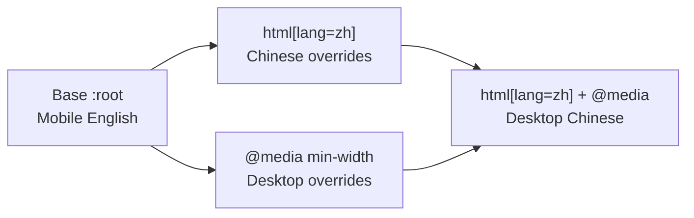

# Design Tokens — Complete Variable Export

Extracted 2026-08-01 from Figma file `zSq5F5v3UrVAdIjuSipe3H` via the Plugin API
(`use_figma` → `getLocalVariableCollectionsAsync`). **All 124 variables, all modes.**
This is the source of truth for `@theme` in `app/globals.css`.

## Table of Contents

- [Why Not get_variable_defs](#why-not-get_variable_defs)
- [Collections & Modes](#collections--modes)
- [Primitives](#primitives)
- [Color Schemes](#color-schemes)
- [Spacing & Sizing](#spacing--sizing)
- [Text Styles](#text-styles)
- [Fonts](#fonts)
- [Implementing the Modes](#implementing-the-modes)
- [Known Problems](#known-problems)

## Why Not get_variable_defs

`get_variable_defs` returns only the variables a queried **node's subtree consumes**, each
resolved to *that consumer's own mode*. It returns a union of mixed modes and omits unused
variables. Four separate page queries surfaced roughly 40 of 124 variables, several labelled
with the wrong mode's value. **Do not use it to build the token set.** Use `use_figma` with
the Plugin API, as this document was built.

## Collections & Modes

| Collection | Variables | Modes |
| :--- | ---: | :--- |
| Primitives | 25 | `Mode 1` (single) |
| Color Schemes | 10 | `Mode 1` (single) |
| Spacing & Sizing | 14 | `Desktop`, `Mobile` |
| Text Styles | 75 | `Mobile English`, `Mobile Chinese`, `Desktop English`, `Desktop Chinese` |

Text Styles = 15 tokens × 5 properties (fontFamily, fontStyle, fontSize, lineHeight, letterSpacing).

## Primitives

Raw values. Never reference these directly in components — go through Color Schemes.

| Token | Value |
| :--- | :--- |
| `Color/White` | `#ffffff` |
| `Color/Neutral Lightest` | `#dee3e7` |
| `Color/Neutral Lighter` | `#cccccc` |
| `Color/Neutral Light` | `#aaaaaa` |
| `Color/Neutral` | `#666666` |
| `Color/Neutral Dark` | `#444444` |
| `Color/Neutral Darker` | `#222222` |
| `Color/Neutral Darkest` | `#131417` |

Opacity ramps (8 white, 8 dark, plus transparent):

| Step | White | Neutral Darkest |
| ---: | :--- | :--- |
| transparent | `#ffffff00` | — |
| 5 | `#ffffff0d` | `#0000000d` |
| 10 | `#ffffff1a` | `#0000001a` |
| 15 | `#ffffff26` | `#00000026` |
| 20 | `#ffffff33` | `#00000033` |
| 30 | `#ffffff4d` | `#0000004d` |
| 40 | `#ffffff66` | `#00000066` |
| 50 | `#ffffff80` | `#00000080` |
| 60 | `#ffffff99` | `#00000099` |

## Color Schemes

Semantic layer. **Use these in components.**

| Token | Resolves to | Value |
| :--- | :--- | :--- |
| `Basic/Background` | → `Color/White` | `#ffffff` |
| `Basic/Foreground` | → `Color/White` | `#ffffff` |
| `Basic/Text/Primary` | → `Color/Neutral Darkest` | `#131417` |
| `Basic/Text/Secondary` | → `Color/Neutral Dark` | `#444444` |
| `Basic/Border` | → `Color/Neutral Darkest` | `#131417` |
| `Basic/Accent` | → `Color/Neutral Darkest` | `#131417` |
| `Brand/Primary Green` | — | `#08c454` |
| `Brand/Accent Neon` | — | `#38ff88` |
| `Brand/Accent Orange` | — | `#ff5e0e` |
| `Brand/Accent Yellow` | — | `#bdff43` |

Single mode — there is **no dark theme** in the variables, despite the `Desktop NAV/DARK`
component. That NAV variant is a per-component styling choice, not a theme.

## Spacing & Sizing

Two modes. **Only the four padding tokens actually differ** — containers and max-widths are
identical across Desktop and Mobile.

| Token | Desktop | Mobile |
| :--- | ---: | ---: |
| `Page Padding/padding-global` | **64** | **20** |
| `Section Padding/padding-section-large` | **112** | **64** |
| `Section Padding/padding-section-medium` | **80** | **48** |
| `Section Padding/padding-section-small` | **48** | **32** |
| `Container/container-large` | 1280 | 1280 |
| `Container/container-medium` | 1024 | 1024 |
| `Container/container-small` | 768 | 768 |
| `Max Width/max-width-xxlarge` | 1280 | 1280 |
| `Max Width/max-width-xlarge` | 1024 | 1024 |
| `Max Width/max-width-large` | 768 | 768 |
| `Max Width/max-width-medium` | 560 | 560 |
| `Max Width/max-width-small` | 480 | 480 |
| `Max Width/max-width-xsmall` | 400 | 400 |
| `Max Width/max-width-xxsmall` | 320 | 320 |

## Text Styles

Font families and styles per mode:

| Token | Mobile EN | Mobile CN | Desktop EN | Desktop CN |
| :--- | :--- | :--- | :--- | :--- |
| `Display/Jumbo` | Alumni Sans Bold | Mochiy Pop One Bold | Alumni Sans Bold | Mochiy Pop One Bold |
| `Display/H1` | Alumni Sans Bold | Mochiy Pop One Regular | Alumni Sans Bold | Mochiy Pop One Regular |
| `Display/H2` | Alumni Sans Bold | Mochiy Pop One Regular | Alumni Sans Bold | Mochiy Pop One Bold |
| `Display/H3` | Alumni Sans Bold | Mochiy Pop One Regular | Alumni Sans Bold | Mochiy Pop One Bold |
| `Display/H4` | Alumni Sans Bold | Mochiy Pop One Bold | Alumni Sans Bold | Mochiy Pop One Bold |
| `Display/H5` | Alumni Sans Bold | Mochiy Pop One Regular | Alumni Sans Bold | Mochiy Pop One Bold |
| `Display/H6` | Alumni Sans Bold | Mochiy Pop One Regular | Alumni Sans Bold | Mochiy Pop One Bold |
| `Display/H7` | Alumni Sans Bold | Mochiy Pop One Regular | Alumni Sans Bold | Mochiy Pop One Bold |
| `Body/L`, `M`, `S`, `XS` | Chivo Mono Regular | **Chivo Mono Regular** | Chivo Mono Regular | **Chivo Mono Regular** |
| `Label/M`, `S` | Chivo Mono Regular | **Chivo Mono Regular** | Chivo Mono Regular | **Chivo Mono Regular** |
| `Accent/Display` | Bodoni Moda SC Bold Italic | Noto Serif TC Bold | Bodoni Moda SC Bold Italic | Noto Serif TC Bold Italic |

Sizes as `fontSize / lineHeight / letterSpacing`:

| Token | Mobile EN | Mobile CN | Desktop EN | Desktop CN |
| :--- | :--- | :--- | :--- | :--- |
| `Display/Jumbo` | 166 / 107.9 / -1.66 | 166 / 107.9 / -1.66 | 246 / 159.9 / -2.46 | 166 / 107.9 / -1.66 |
| `Display/H1` | 113 / 79.1 / -1.13 | 62 / 74.4 / -1.24 | 220 / 158 / -2.8 | 150 / 170 / -2.7 |
| `Display/H2` | 87 / 60.9 / -0.87 | 43 / 51.6 / -0.43 | 180 / 118 / -1.2 | 130 / 140 / -0.87 |
| `Display/H3` | 78 / 54.6 / -0.78 | 38 / 45.6 / -0.76 | 120 / 84 / -1.2 | 78 / 90 / -0.78 |
| `Display/H4` | 55 / 41.25 / -0.55 | 34 / 40.8 / -0.34 | 78 / 58 / -0.55 | 55 / 60 / -0.55 |
| `Display/H5` | 41 / 32.8 / -0.41 | 28 / 33.6 / -0.28 | 41 / 32.8 / -0.78 | 28 / 33.6 / -0.28 |
| `Display/H6` | 27 / 21.6 / -0.27 | 18 / 21.6 / -0.18 | 27 / 21.6 / -0.27 | 18 / 21.6 / -0.27 |
| `Display/H7` | 22 / 17.6 / -0.22 | 16 / 19.2 / -0.16 | 32 / 25.6 / -0.32 | 22 / 28 / -0.22 |
| `Body/L` | 16 / 24 / -0.16 | 16 / 24 / -0.16 | 16 / 24 / -0.16 | 16 / 24 / -0.16 |
| `Body/M` | 14 / 21 / -0.14 | 14 / 21 / -0.14 | 14 / 21 / -0.14 | 14 / 21 / -0.14 |
| `Body/S` | 13 / 19.5 / -0.13 | 13 / 19.5 / -0.13 | 13 / 19.5 / -0.13 | 13 / 19.5 / -0.13 |
| `Body/XS` | 12 / 18 / 0 | 12 / 18 / 0 | 12 / 18 / 0 | 12 / 18 / 0 |
| `Label/M` | 11 / 11 / 0.55 | **14 / 14** / 0.55 | 11 / 11 / 0.55 | 11 / 11 / 0.55 |
| `Label/S` | 11 / 11 / 0.55 | 11 / 11 / 0.55 | 11 / 11 / 0.55 | 11 / 11 / 0.55 |
| `Accent/Display` | 37 / 37 / 0.37 | 37 / 48.1 / 0.37 | 37 / 37 / 0.37 | 37 / 48.1 / 0.37 |

`lineHeight` and `letterSpacing` are absolute px in Figma, not ratios/em.

**Body sizes are identical across all four modes.** Only Display, Accent, and `Label/M`
(mobile Chinese) vary. So the locale dimension matters almost entirely for display type.

## Fonts

Five families, all on Google Fonts:

| Family | Role | Styles needed |
| :--- | :--- | :--- |
| Alumni Sans | Latin display | Bold (700) |
| Mochiy Pop One | Chinese display | Regular (400) **and "Bold"** |
| Chivo Mono | Body + Label, both locales | Regular (400) |
| Bodoni Moda SC | Latin accent | Bold Italic |
| Noto Serif TC | Chinese accent | Bold, **"Bold Italic"** |

## Implementing the Modes

The 4 text modes are exactly breakpoint × locale, so they map to CSS without a runtime:

Spacing & Sizing has only Desktop/Mobile, so it keys off the media query alone.

**The Desktop/Mobile switch width is not defined in the variables.** The designs are 393px
and 1440px; `Container/container-small` is 768. **Resolved by D009 in `openspec/DECISIONS.md`
— 1024px**, matching `Container/container-medium`.

## Known Problems

**Resolved by D008 in `openspec/DECISIONS.md` — implement the variables as-is.** Kept here so
no phase mistakes these for implementation bugs. Three issues render differently in a browser
than in Figma; all are accepted.

| # | Problem | Consequence |
| ---: | :--- | :--- |
| 1 | **Chinese body and label text uses Chivo Mono** — confirmed in all 4 modes. Chivo Mono has no CJK coverage. | Every Chinese paragraph falls back to an OS font. Renders acceptably on macOS (PingFang), differently on Windows/Android. Half the site's body copy has no specified typeface. |
| 2 | **Mochiy Pop One ships only Regular (400) on Google Fonts** — there is no Bold. The design uses "Bold" for Jumbo, H2–H7 in Desktop Chinese and Jumbo/H4 in Mobile Chinese. | Figma is faux-bolding. A browser will either synthesize a different-looking bold or ignore it. Chinese display type will not match the design. |
| 3 | **Noto Serif TC has no italic.** The design specifies "Bold Italic" for Desktop Chinese `Accent/Display`. | Same as above — synthetic oblique, or nothing. |

Additionally, **Mochiy Pop One is a Japanese font**, not a Traditional Chinese one. It renders
most TC but uses Japanese glyph forms for some characters and its TC-specific coverage is not
guaranteed. Accepted as-is per D008; designer confirmation was waived.
